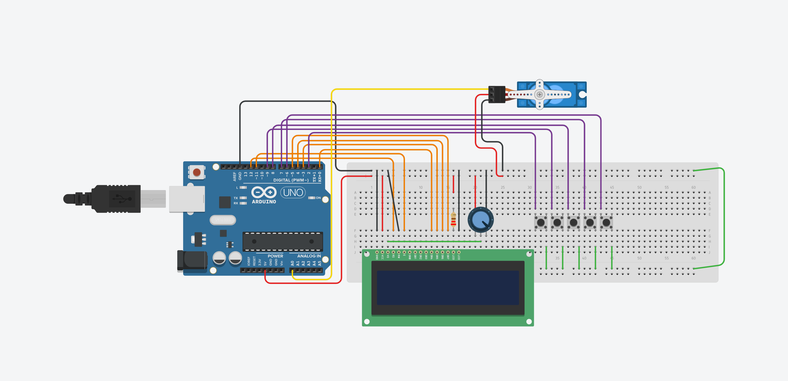

# Simple Tea Machine

## Features / Technology
- Time Interrupter
- Display and Timer Control
- Servo
- Potentiometer

### Description / Process
1. Put a cup of hot water on the machine
2. Hang a tea bag on the paperclip which is connected with a line
3. Set the timer to brew your tea
4. Start the machine
5. When the task is completed => Enjoy your tea 😋